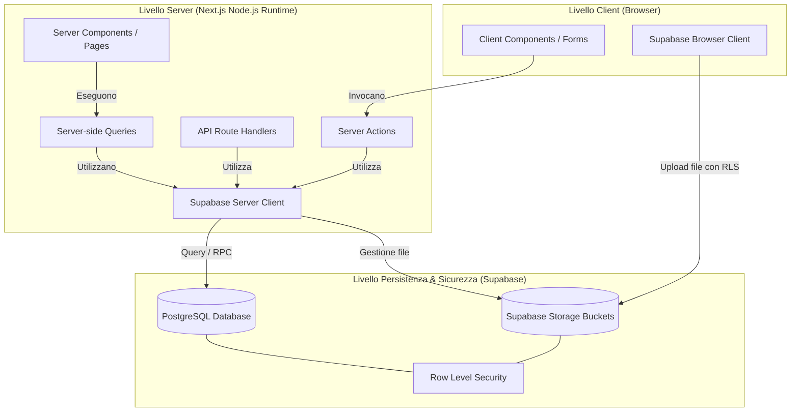

# Architettura del Progetto

Questa pagina descrive l'architettura logica, la struttura delle directory, la gestione del routing e il flusso delle dipendenze di **Casa Nostra**.

---

## Livelli Logici e Flusso delle Dipendenze

Il progetto segue un'architettura a tre livelli, adattata alle convenzioni moderne di Next.js App Router:

Il flusso di dipendenza è rigorosamente unidirezionale dall'alto verso il basso:
1. **Livello Client**: I Client Component (es. form interattivi, grafici) risiedono sulla pagina web e inviano dati al server tramite **Server Actions** o caricano direttamente file su **Supabase Storage** (sotto autenticazione client-side).
2. **Livello Server**: I Server Component caricano i dati direttamente tramite query asincrone al database. Le Server Actions gestiscono le validazioni e le mutazioni dei dati. Entrambi comunicano con Supabase usando il client server-side.
3. **Livello Database**: Tutte le regole di business transazionali (es. conguagli) e le policy di sicurezza (RLS) sono applicate ed eseguite direttamente in Supabase (Postgres).

---

## Struttura delle Directory

La struttura del progetto segue la convenzione standard di Next.js:

* `app/` → `app/`: Contiene le rotte, i layout e le Server Actions.
  * `(app)/` → `app/(app)/`: Rotte private protette da autenticazione (home, spese, conguaglio, impostazioni, statistiche).
  * `actions/` → `app/actions/`: Server Actions per le mutazioni dei dati (es. `expenses.ts`, `auth.ts`).
  * `api/` → `app/api/`: Endpoint API serverless (l'assistente IA).
  * `landing/` → `app/landing/`: Landing page pubblica per utenti non autenticati.
  * `login/` → `app/login/`: Pagina di login.
* `components/` → `components/`: Componenti React riutilizzabili.
  * `ui/` → `components/ui/`: Elementi UI di base (Card, Button, Dialog, ecc.).
* `lib/` → `lib/`: Utility di formattazione, funzioni di calcolo e client Supabase.
  * `supabase/` → `lib/supabase/`: Inizializzazione dei client Supabase per browser e server.
* `types/` → `types/`: Tipi TypeScript generati dal DB e costanti dell'applicazione.
* `docs/` → `docs/`: Documentazione di progetto (schema SQL, log delle modifiche, requisiti).

---

## Routing e Ciclo di Vita delle Pagine

L'applicazione definisce rotte pubbliche e rotte private.

### Rotte Pubbliche
* `/landing` → `app/landing/page.tsx`: Vetrina del servizio ed esposizione delle feature.
* `/login` → `app/login/page.tsx`: Schermata di autenticazione con email e password → `app/actions/auth.ts`.

### Rotte Private
* `/` → `app/(app)/page.tsx`: Dashboard principale con saldo e ultime 5 spese.
* `/spese` → `app/(app)/spese/page.tsx`: Storico completo delle spese con filtri avanzati.
* `/spese/[id]` → `app/(app)/spese/[id]/page.tsx`: Dettaglio e modifica/eliminazione di una singola spesa.
* `/conguaglio` → `app/(app)/conguaglio/page.tsx`: Schermata di riepilogo e registrazione del conguaglio.
* `/statistiche` → `app/(app)/statistiche/page.tsx`: Grafici sull'andamento delle spese di casa.
* `/impostazioni` → `app/(app)/impostazioni/page.tsx`: Gestione del profilo utente (display name, cambio password).

---

## Middleware e Confine di Sicurezza (`proxy.ts`)

A causa dell'utilizzo di **Next.js 16**, il file standard `middleware.ts` è deprecato e sostituito da `proxy.ts` nella root del progetto → `proxy.ts`.

La funzione `proxy(request)` intercetta tutte le richieste HTTP corrispondenti al matcher ed esegue i seguenti passaggi di sicurezza:
1. **Refresh della Sessione**: Recupera la sessione utente tramite `supabase.auth.getUser()` ed aggiorna i cookie di sessione per mantenere l'autenticazione attiva → `proxy.ts#L26`.
2. **Controllo Autenticazione & Redirect**:
   * Se l'utente **non è autenticato** e richiede una risorsa privata (qualsiasi rotta tranne `/landing` e `/login`), viene reindirizzato a `/landing` → `proxy.ts#L33`.
   * Se l'utente **è autenticato** e tenta di accedere a `/landing` o `/login`, viene reindirizzato alla home `/` → `proxy.ts#L40`.

---

## Confine Server/Client

Next.js App Router separa nettamente i componenti in base all'ambiente di esecuzione:

### Server Components (Default)
Caricano i dati direttamente sul server ed effettuano il rendering iniziale in HTML. Esempi:
* La pagina di dettaglio di una spesa `/spese/[id]` carica i dati della spesa e gli allegati via `getExpenseById` e `getExpenseAttachments` prima del rendering.

### Client Components (`'use client'`)
Gestiscono l'interattività e lo stato lato browser. Esempi:
* `HomeShell.tsx` → `components/HomeShell.tsx`: Gestisce lo stato della modale ("Sheet") per l'inserimento rapido di una spesa e inserisce una spesa ottimistica ("Optimistic UI") nella lista prima del completamento della Server Action.
* `ExpenseForm.tsx` → `app/(app)/spese/nuova/ExpenseForm.tsx`: Gestisce la selezione dinamica dei chip e i messaggi di validazione istantanei.
