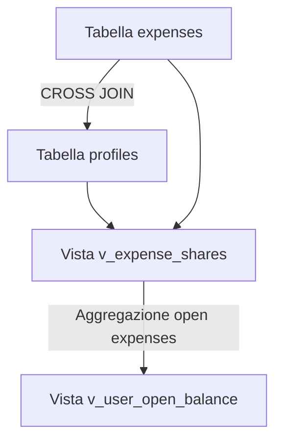

# Accesso ai Dati e Logica di Database

Questa pagina documenta la strategia di accesso ai dati, l'integrazione con il client Supabase, le query dell'applicazione e la logica di calcolo del saldo basata su viste SQL.

---

## Integrazione del Client Supabase

Il progetto utilizza il pacchetto `@supabase/ssr` per gestire l'autenticazione basata su sessione e cookie. Sono implementati due client distinti a seconda del contesto di esecuzione:

### 1. Client Browser (`browser.ts`)
Utilizzato nei Client Component per operazioni interattive che avvengono sul browser (es. caricamento dei file di scontrini) → `lib/supabase/browser.ts`:
* Inizializza il client con `createBrowserClient` usando le variabili d'ambiente pubbliche `NEXT_PUBLIC_SUPABASE_URL` e `NEXT_PUBLIC_SUPABASE_ANON_KEY`.

### 2. Client Server (`server.ts`)
Utilizzato nei Server Component, nelle Server Actions e nelle API Route Handlers → `lib/supabase/server.ts`:
* Inizializza il client con `createServerClient` e acquisisce i cookie tramite `cookies()` di Next.js.
* **Refresh dei Cookie**: La logica di scrittura dei cookie (`setAll`) è avvolta in un blocco `try-catch` → `lib/supabase/server.ts#L17-L24`. Se il client viene invocato durante il rendering di un Server Component (fase in cui Next.js vieta la scrittura degli header), l'errore viene ignorato. Il refresh effettivo dei cookie di sessione è delegato a monte al middleware `proxy.ts`.

### 3. Client Service Role (`service.ts`)
Utilizzato **esclusivamente** dal webhook Telegram → `lib/supabase/service.ts`:
* Inizializza il client con `SUPABASE_SERVICE_ROLE_KEY` e senza persistenza di sessione: gli update di Telegram arrivano senza cookie, quindi non esiste una sessione da cui derivare i permessi.
* Questa chiave **bypassa RLS**: l'autorizzazione, in quel percorso, la fa il webhook verificando il secret dell'update e il collegamento `profiles.telegram_user_id`.
* Le funzioni di `lib/queries.ts` accettano un parametro opzionale `db` proprio per essere riusate con questo client (omesso, usano il client di sessione con RLS attiva).

---

## Query Core dell'Applicazione

Tutte le operazioni di lettura dati sono isolate in file di query dedicati:

### Modulo Spese Condivise (`queries.ts`)
* `getOpenBalance()` → `lib/queries.ts#L9`: Interroga la vista `v_user_open_balance` per ottenere il saldo netto corrente di ciascun utente.
* `getRecentExpenses(limit)` & `getAllExpenses()` → `lib/queries.ts#L25,L38`: Recuperano le spese eseguendo un join esplicito sulla chiave esterna (`profiles!expenses_paid_by_fkey(display_name)`) per ricavare il nome visualizzato del pagatore.
* `getExpenseAttachments(expenseId)` → `lib/queries.ts#L62`: Recupera le righe degli allegati dal DB. Per ogni allegato, genera un URL firmato temporaneo (della durata di 1 ora) chiamando `supabase.storage.createSignedUrls()` sul bucket, consentendo la visualizzazione dei file privati sia nella UI che all'assistente IA.
* `getOpenExpensesWithContribution(userId)` → `lib/queries.ts#L107`: Calcola il contributo netto individuale ($Anticipato - Quota$) per ciascuna spesa aperta per l'utente corrente. Viene utilizzato nella schermata di conguaglio per mostrare come ogni singola spesa contribuisce al saldo finale.
* `getExpenseIdsWithAttachments()` → `lib/queries.ts`: Restituisce l'insieme degli id di spesa che hanno almeno un allegato; l'assistente lo usa per marcare le spese con 📎scontrino nel contesto.
* `getFrequentDescriptions(limit)` → `lib/queries.ts`: Recupera le ultime 200 descrizioni inserite ed effettua un conteggio delle frequenze in memoria sul server. Evita l'esposizione di funzioni RPC aggiuntive e fornisce i suggerimenti rapidi per il form.

---

## Calcolo del Saldo tramite Viste SQL

La logica di ripartizione e di calcolo del saldo non viene eseguita a livello applicativo, ma è centralizzata sul database Postgres tramite due viste SQL:



### 1. Vista quote spese (`v_expense_shares`)
Calcola la quota spettante a ciascun utente per ogni singola spesa inserita, applicando le regole di business del dominio → `docs/casa_nostra_schema.sql#L168-L184`:
* **Regola 50/50 (`fifty_fifty`)**: La quota utente è pari al 50% dell'importo spesa.
* **Regola 60/40 (`sixty_forty`)**: Il partner con `higher_income = true` riceve una quota del 60%; l'altro del 40%.
* **Regola Personalizzata (`custom`)**: L'utente che non ha pagato riceve in addebito il valore presente in `custom_other_share`; l'utente che ha pagato riceve in addebito la differenza ($Importo - custom\_other\_share$).

### 2. Vista saldi correnti (`v_user_open_balance`)
Calcola la posizione netta di ciascun utente sommando i dati della vista quote limitatamente alle spese aperte (`settlement_id IS NULL`) → `docs/casa_nostra_schema.sql#L193-L211`:
* **Anticipato (`total_anticipated`)**: Somma degli importi delle spese pagate dall'utente.
* **Dovuto (`total_owed`)**: Somma delle quote di spesa a carico dell'utente (calcolate da `v_expense_shares`).
* **Posizione Netta (`net_position`)**: Differenza tra anticipato e dovuto ($total\_anticipated - total\_owed$).
  - $net\_position > 0$: L'utente è in credito (ha anticipato più di quanto dovuto). L'altro utente gli deve dei soldi.
  - $net\_position < 0$: L'utente è in debito. Deve dei soldi all'altro utente.

---

## Logica di Conguaglio Transazionale (RPC)

Il conguaglio delle spese avviene in modo atomico sul database Postgres tramite la funzione `register_settlement` dichiarata con clausola `SECURITY DEFINER` → `docs/casa_nostra_schema.sql#L306-L394`.

### Firma della Funzione
```sql
CREATE OR REPLACE FUNCTION public.register_settlement(
  p_notes text DEFAULT NULL,
  p_expense_ids uuid[] DEFAULT NULL
) RETURNS uuid
```

### Logica di Esecuzione
1. **Controllo Autenticazione**: Verifica che il chiamante (`auth.uid()`) sia uno dei due profili registrati.
2. **Selezione Spese**:
   * Se viene passato un array di `p_expense_ids`, la funzione valida che tutte le spese siano aperte e calcola la posizione netta del chiamante limitatamente a quel subset.
   * Se l'array è nullo, calcola il saldo totale aperto prelevando `net_position` da `v_user_open_balance` per tutte le spese.
3. **Controllo Saldo**: Se la posizione netta calcolata è nulla o pari a 0, solleva un'eccezione abortendo la transazione.
4. **Identificazione Direzione Bonifico**:
   * Se la posizione netta del chiamante è positiva (in credito), imposta come destinatario (`to_user_id`) il chiamante e come mittente (`from_user_id`) l'altro partner.
   * Se è negativa (in debito), imposta il chiamante come mittente e l'altro partner come destinatario.
5. **Scrittura Record**: Inserisce una riga nella tabella `settlements` con l'importo assoluto del saldo e la direzione del bonifico.
6. **Chiusura Spese**: Esegue un'operazione di `UPDATE` sulla tabella `expenses` impostando il `settlement_id` appena generato per tutte le spese conguagliate, marcandole formalmente come saldate.
